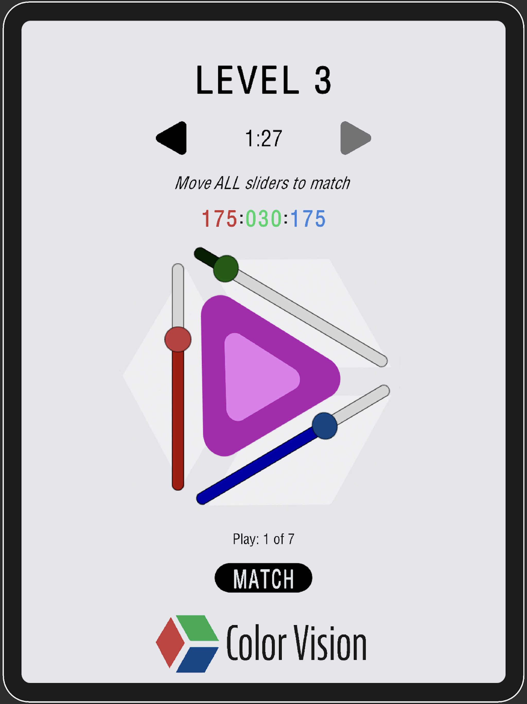
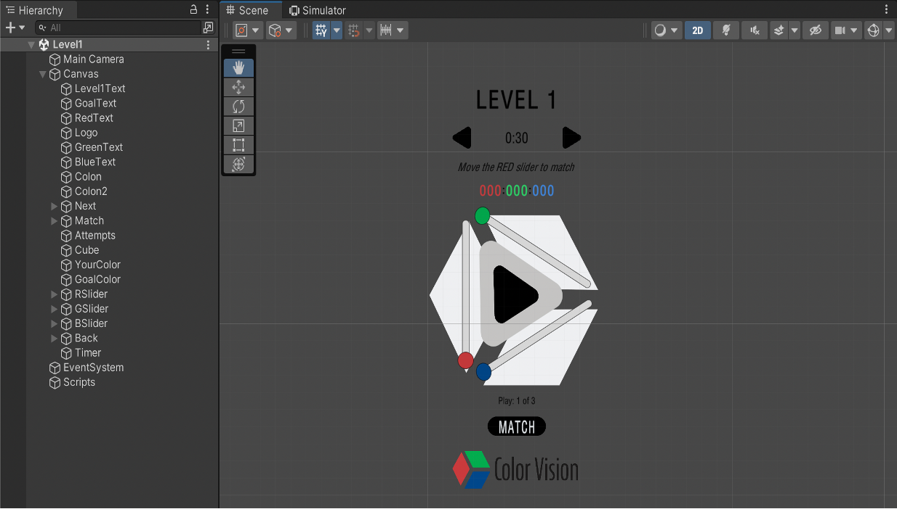
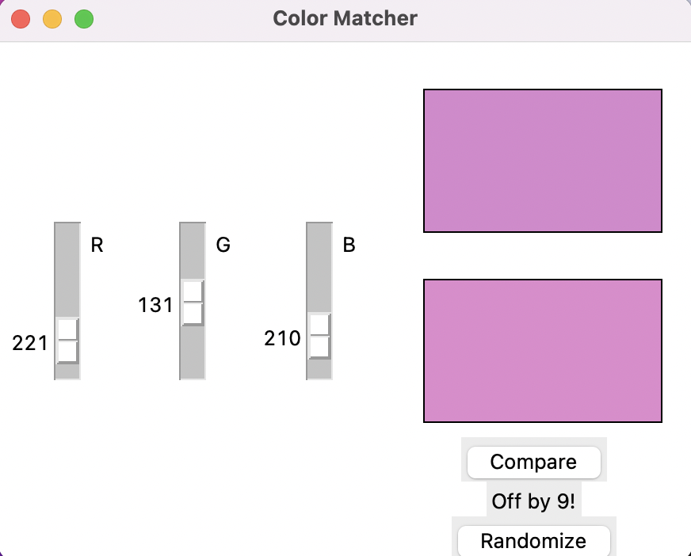
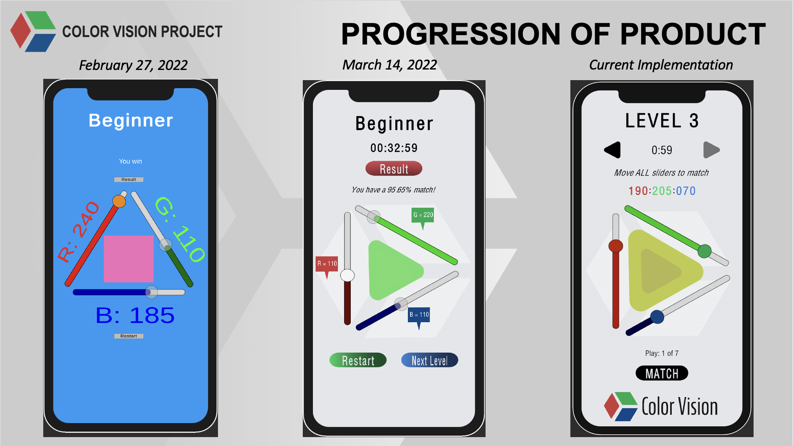

# Overview

Welcome to the Color Vision Score App! This application aims to determine the extent to which people can see the 16.7 million colors on the RGB spectrum. To do this, users navigate three levels of color-matching and receive a score (out of 800 like the SAT), representing their overall accuracy and efficiency when matching across each level. The inner shape is colored a randomly generated RGB, so the user moves the R, G, and B sliders (all if on Level 3) to alter the outer shape's color to match the inner shape's. Users have a set amount of time and attempts for each level that factor into the final score calculation.

  

# Technical Overview

The Color Vision Score App uses Unity's Mobile Development toolkit to build and scale the application for all mobile devices. The application was built using Unity frontend and C# backend. The application was deployed with Xcode. Here, we see the component breakdown for Level 1 of 3.

# Agile Development Process

We started with a basic prototype design to depict matching to the correct RGB.

  

 

We then transitioned to an overlay design as we built and modifified features based on that foundation.

  
  
 Note: there are far more iterations between those shown. 

# Demo

Check out a demo <a href="https://youtube.com/shorts/5zrQrqdodDQ">here</a>. This received 100+ downloads across iOS and Android devices not long ago!

