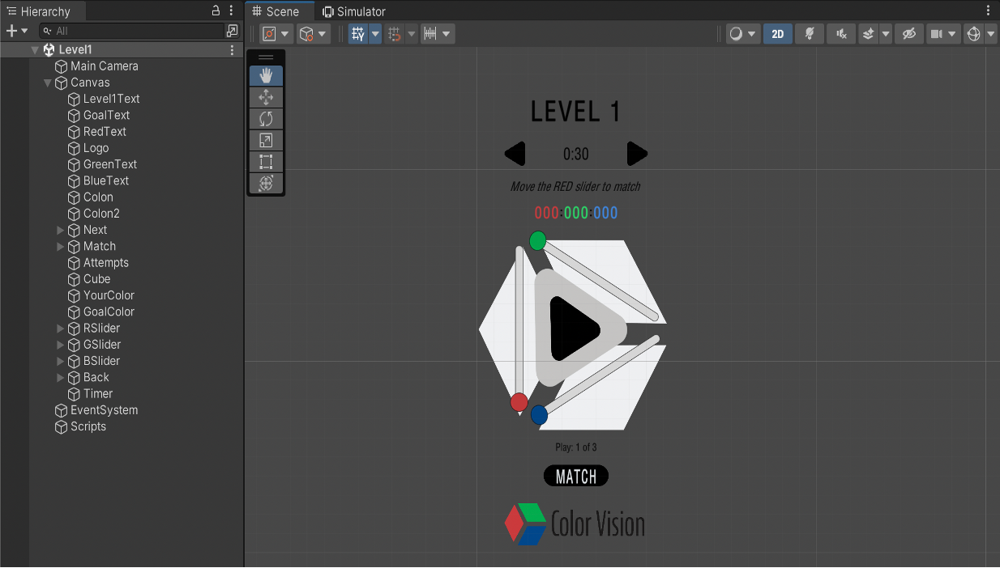

# Overview

Welcome to the Color Vision Score App! This application aims to determine the extent to which people can see the 16.7 million colors on the RGB spectrum. To do this, users navigate three levels of color-matching and receive a score (out of 800 like the SAT), representing their overall accuracy and efficiency when matching across each level.

# Technical Overview

The Color Vision Score App uses Unity's Mobile Development toolkit to build and scale the application for all mobile devices. The application was built using Unity frontend and C# backend. The application was deployed with Xcode. Here, we see the component breakdown for Level 1 of 3.

# Application Progression

An agile development process was used to create each iteration of the application.
